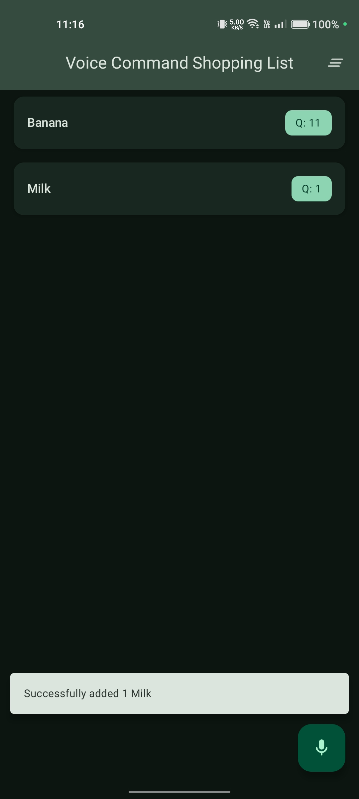
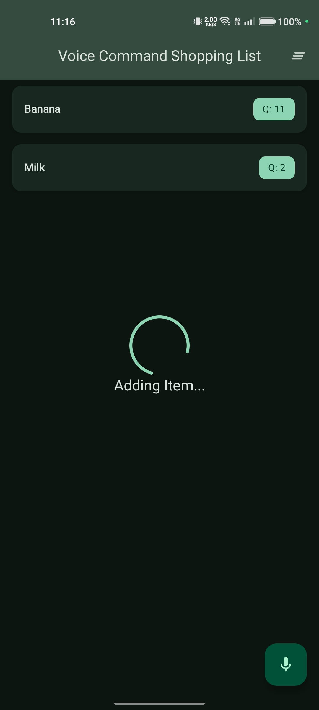

# Voice-Command-Shopping-List

## Overview

The **Voice Command Shopping List** is an Android app built using **Jetpack Compose** that allows users to manage their shopping lists using **voice commands**. It features **voice-activated inputs, restock suggestions, and a minimalist UI** for an intuitive shopping list experience.

## Features

- **Voice Input:** Add, remove, and manage items using voice commands.
- **Restock Notifications:** Notifies the user about needing a restock on an item based on previous list entries.
- **Minimalist UI:** Clean and easy-to-use interface.
- **Shopping List Management:** Allow users to add, remove, or modify items using voice commands (e.g., “Remove milk”, “Add 10 apples”).
- **Error Handling:** Ensures smooth user experience with proper error messages

## Tech Stack

- **Android:** Jetpack Compose, Kotlin
- **State Management:** StateFlow
- **Dependency Injection:** Dagger/Hilt
- **Database:** Room (for local storage)
- **Background Tasks:** WorkManager

## Technical Approach

### Core Architecture

- Implemented Clean Architecture with clear separation of data, domain, and presentation layers.
- Utilized MVVM pattern with Jetpack Compose for modern, declarative UI.
- Leveraged Dagger Hilt for dependency injection throughout the application.

### Voice Processing

- Used Android's native **SpeechRecognizer** for voice input capture.
- Implemented custom **NLPProcessor** using **Hugging Face's BART-large-mnli** model for intent classification
- Created intent processing system supporting commands:
    - Add items with quantity ("Add 2 apples")
    - Remove items ("Remove bananas")

### Data Management

- Utilized **Room** Database with dual database approach:
    - `ShoppingListDb`  : Manages current shopping list items
    - `ShoppingHistoryDb` :Tracks history and enables restock suggestions
- Implemented Repository pattern with `ShoppingListRepositoryImpl` and `ShoppingHistoryRepositoryImpl`
- Used Kotlin Flow for reactive data streams between layers

### UI Implementation

- Built Material 3 UI using **Jetpack Compose** with proper state management.
- Implemented features:
    - Voice command FAB for easy access
    - Shopping list with quantity indicators
    - Clear all functionality
    - Snackbar notifications for user feedback
    - Reactive UI updates using StateFlow and SharedFlow

### Smart Features

- Basic restock suggestions
- Automated quantity management for duplicate items
- Background work management for notifications using WorkManager
- Error handling and user feedback system

## Project Structure

```bash
Voice-Command-Shopping-List/
│── app/
│   ├── src/
│   │   ├── main/
│   │   │   ├── java/com/example/voicecommandshoppinglist/
│   │   │   │   ├── data/          
│   │   │   │   ├── di/            
│   │   │   │   ├── domain/        
│   │   │   │   ├── presentation/  
│   │   │   ├── res/               
│── local.properties        
```

## Installation

1. Clone the repository:

    ```bash
    git clone https://github.com/abhayy08/Voice-Command-Shopping-List.git
    ```

2. Open the project in **Android Studio**.
3. Get you **Hugging Face API Access Token:**
    - Go to [https://huggingface.co/](https://huggingface.co/) → Log In
    - Create your access token for Hugging Face API.
4. Store the API key in your **local.properties** file:
    - Open `local.properties` in the root of your project.
    - Add the following line:

        ```kotlin
        hugging_face_api_key="your_api_key_here"
        ```

5. Sync the Gradle files and build the project.
6. Run the app on an emulator or a physical device.

## Screenshots

<p align="center">
  
  
</p>

## Usage

1. **Launch the app** and grant necessary permissions.
2. **Tap the microphone button** and speak to add or remove items (Valid commands : “Add Apples”, “Add 10 Apples”, “Remove Apple” etc. ).
3. **View and manage your list.**

## API & Dependencies

- **OkHttpClient** (for making calls to the Hugging-Face API)
- **Hugging-Face API** (for identifying the intent of speech)
- **Room Database** (for local storage)
- **Hilt/Dagger** (for dependency injection)
- **WorkManager** (for background tasks, in this case scheduling periodic notification for restock)
- **Material Icons**